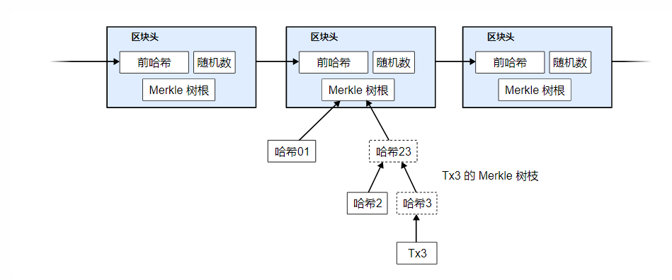
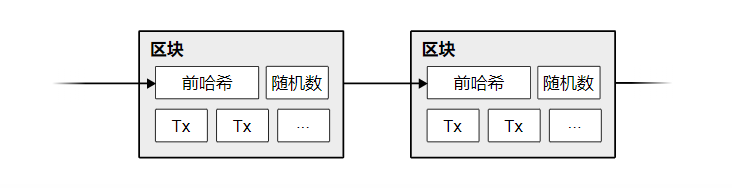
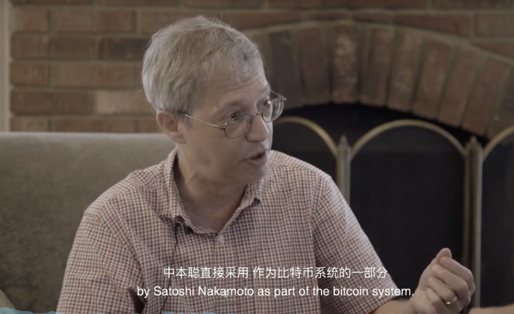
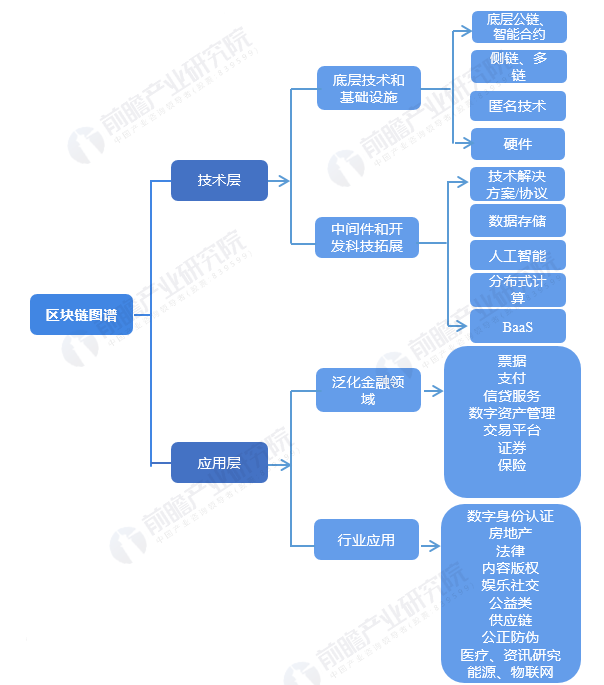

# 区块链

## 概念

### 百度百科

> 区块链是一个信息技术领域的术语。从本质上讲，它是一个**共享数据库**，存储于其中的数据或信息，具有**“不可伪造”“全程留痕”“可以追溯”“公开透明”“集体维护”**等特征。基于这些特征，区块链技术奠定了坚实的“信任”基础，创造了可靠的“合作”机制，具有广阔的运用前景。
>
> 2019年1月10日，国家互联网信息办公室发布《区块链信息服务管理规定》 [1]  。2019年10月24日，在中央政治局第十八次集体学习时，习近平总书记强调，“把区块链作为核心技术自主创新的重要突破口”“加快推动区块链技术和产业创新发展”。“区块链”已走进大众视野，成为社会的关注焦点。

### 维基百科

> 是由密码学串接并保证内容的串联文字记录。

### IBM

> 区块链是一个共享的、不可更改的账本，可以促进在业务网络中记录交易和跟踪资产的过程。资产可以是有形的（例如房屋、汽车、现金、土地），也可以是无形的（列如知识产权、专利、版权、品牌）。几乎任何有价值的东西都可以在区块链网络上进行跟踪和交易，从而降低各方面的风险和成本。

- **去中心化**

- **可追溯** 

- **不可篡改**

## 区块链（公链）发展简史

> 诞生于1990年，并不是中本聪发明的
>
> 贝尔通信研究所, Stuart, Scott 

Scott 为了解决相互之间信任的问题。分布式信任，广泛见证的事件。使用单向哈希函数把数据结构中的文档归结在一起，出于时间戳的目的。我们使用单向哈希函数冻结文档，把文档归结到现在称为区块链的东西上去，这个解决方案被中本聪直接采用，作为比特币系统的一部分。

有时候我们并不是在等待技术的突破，而是技术在等待我们发现他们的光芒。

2008

区块链1.0 只是简单的记账

2014

区块链2.0，智能合约

2018

区块链3.0，高性能，大吞吐量，开发者友好，用户友好 EOS，ArcBlock

比特币(1.0) -- 以太坊(2.0)  -- ? (3.0)

## BTC

https://btcpapers.com/

>  中本聪于2008年发表了一篇名为《比特币：一种点对点式的电子现金系统》的论文，描述了一种被他称为“比特币”的电子货币及其算法。2009年，他发布了首个比特币软件，并正式启动了比特币金融系统。2010年，他逐渐淡出并将项目移交给比特币社区的其他成员。中本聪据信持有约一百万个比特币。

> 定义：一个纯正的**点对点**去**中心化**的加密数字货币，应能够通过在线支付将币从一方直接发送到另一方，而无需通过任何中心金融机构。

## ETH

> 创始人 Vitalik Buterin
>
> 2014年1月，Vitalik Buterin在自己任编辑的比特币杂志（Bitcoin Magazine）上发表《以太坊：一个下一代智能合约和去中心化应用平台》(Etherum: A Next-Generation Smart Contract and Decentralized Application Platform)
>
> 2015年7月30日，以太坊主网正式上线

以太坊浏览器 https://cn.etherscan.com/

ICO众筹

> 只要写个白皮书就可以筹钱，产生了大量的泡沫

### 特点

> * 以太坊是“世界“计算机（具有图灵完备性），这代表她是一个开源的全球分布的计算基础设施
> * 执行成为智能合约（smart contract）的程序
> * 使用区块链来同步和存储系统状态以及名为以太币的加密货币
> * 以太坊平台使得开发人员能够构建具有经济功能的强大去中心化应用程序（DApp）；
> * 。。。。。。

## 现状及产业链

> 区块链技术还在发展初期，很多人预测它是下一个向互联网一样的颠覆性技术。
>
> 比特币相对于区块链就像互联网早期的电子邮件一样

### 公有链

> 是指全世界任何人都可读取的、任何人都能发送交易且交易能获得有效确认的、任何人都能参与其中共识过程的区块链。

### 私有链

> 私有链是指写入权限完全在一个组织手里的区块链，所有参与到这个区块链中的节点都会被严格控制。

### 联盟链

> 是指由特定组织或团体管理的区块链，需要预先指定一些节点为记账人，每个区块的生成由所有记账人共同决定，其他节点可以交易，但没有记账权。

### 具体的应用场景举例

> - 奢侈品名酒的防伪，通过一个nfc芯片来查询商品在生产加工过程中在区块链中的数据
>
> - 解决经济不发达地区的问题，使用区块链进行融资，使用虚拟货币来替换法币（法币可能不太强势，例如津巴布韦）、
>
> - 改善全球儿童福利，现在还有很多贫困地区的儿童还没有出生证。通过让这些儿童的信息进入区块链可以更好的让他们得到帮助。
> - 取代优步、滴滴这样的公司的存在。这样的公司存在的主要原因就是乘客和司机之间的不信任。而区块链恰好就是解决相互信任的问题。
> - 解决数字音乐的版权问题，让创作者可以挣钱，使创作者可以靠内容套现。平台赚了很多钱，苹果，网易云音乐等。

## 未来的发展趋势

各个私有链公有链之间实现互通，就像互联网早期只有很多局域网，后来连接在一起就成了互联网。

可能会发展成一种通讯技术，未来会出现标准的协议，就像现在的TCP/IP、HTTP

TW作为一家咨询公司帮助企业组建区块链的团队，进行赋能。并把区块链和敏捷开发进行一个结合，和客户共同探索区块链的具体应用场景。他们已经有了很多成功的案例，尤其是在金融领域。

BSN更像是在搭建区块链的基础设施（区块链还在起步阶段），做基础设施和标准的永远是最赚钱的。

区块链之新 https://www.bilibili.com/bangumi/play/ep290332?from=search&seid=2763168758770485328

