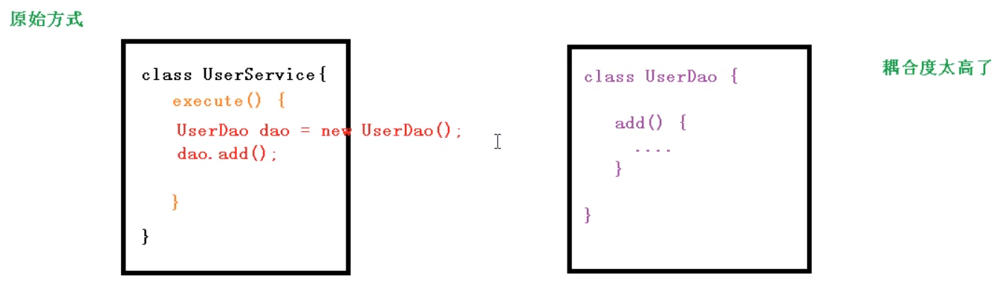
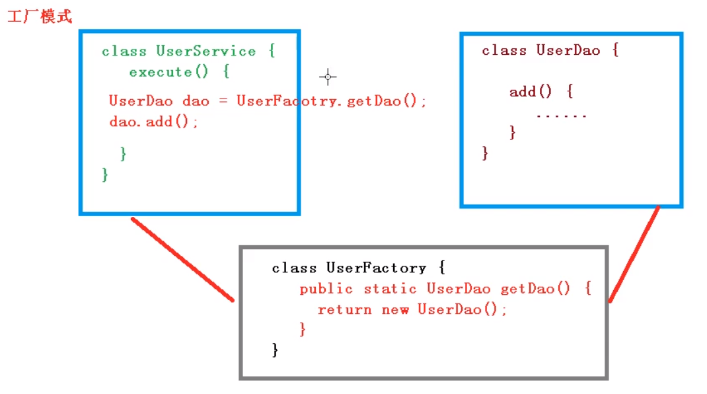
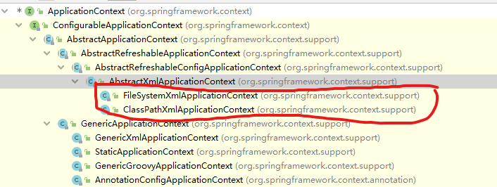

[课程地址](https://www.bilibili.com/video/BV1Vf4y127N5)


# 课程内容

* Spring概念

* IOC容器

  > IOC底层原理
  >
  > IOC接口（BeanFactory）
  >
  > IOC操作Bean管理(基于xml)
  >
  > IOC操作Bean管理(基于注解)

* AOP

* JdbcTemplate

* 事务管理

* Spring5 新特性

# Spring框架概述

1. Spring是轻量级的开源JavaEE应用程序框架
2. 解决企业应用开发的复杂性
3. Spring有两个核心部分：IOC和Aop
   1. IOC: 控制反转，把创建对象的过程交给Spring进行管理
   2. Aop：面向切面，不修改源码进行功能增强

4. Spring特点
   1. 方便解耦，简化开发
   2. Aop编程支持
   3. 方便程序测试
   4. 方便和其他框架进行整合
   5. 方便进行事务操作
   6. 降低API开发难度

5. 现在的课程选取Spring版本5.x

# 入门案例

1. 下载Spring, 使用最新稳定版本5.3.6, spring.io


  2. [下载地址](https://repo.spring.io/release/org/springframework/spring/)

     

3. 创建Java项目

    

4. 导入Spring5相关jar包


> 所需jar包 beans core context expression commons-log


5. 创建普通类，在这个类里创建普通方法

~~~ java
public class User {

    public void add(){
        System.out.println("add ...");
    }
}
~~~

5. 创建Spring配置文件，在配置文件配置创建对象

~~~xml
<?xml version="1.0" encoding="UTF-8"?>
<beans xmlns="http://www.springframework.org/schema/beans"
       xmlns:xsi="http://www.w3.org/2001/XMLSchema-instance"
       xsi:schemaLocation="http://www.springframework.org/schema/beans http://www.springframework.org/schema/beans/spring-beans.xsd">

    <!-- 配置User对象创建 -->
    <bean id="user" class="com.wpy.spring5.User"></bean>
    
</beans>
~~~

6. 进行测试代码编写

~~~ java
package com.wpy.spring5.testdemo;

import com.wpy.spring5.User;
import org.junit.Test;
import org.springframework.context.ApplicationContext;
import org.springframework.context.support.ClassPathXmlApplicationContext;

public class TestSpring5 {

    @Test
    public void testAdd() {
        // 1. 加载spring配置文件
        ApplicationContext context = new ClassPathXmlApplicationContext("bean1.xml");
        // 2. 获取配置创建的对象
        User user = context.getBean("user", User.class);
        System.out.println(user);
        user.add();
    }
}

~~~


# IOC(概念和原理)

> **控制反转**(Inversion of Control, 缩写IoC)，是面向对象中的一种设计原则，是面向对象编程中的一种设计原则，可以用来减低计算机代码之间的耦合度。其中最常见的方式叫做依赖注入，还有一种方式叫做依赖查找。通过控制反转，对象在被创建的时候吗，由一个调控系统内所有对象的外界实体将其所依赖的对象的医用传递给它。也可以说，依赖被注入到对象中。


## 是么是IOC

1. 控制反转，把对象的创建和对象之间的调用过程，交给Spring进行管理。
2. 使用IoC目的：为了耦合度降低。
3. 前面做入门案例就是IOC实现


## IOC底层原理

1. xml解析、工厂模式、反射


## 画图讲解IOC底层原理






以上工厂模式并没有把耦合度降到最低


##  IOC过程

> 进一步降低耦合度

1. 配置xml文件，配置创建的对象

~~~xml
<bean id="dao" class="com.wpy.UserDao"></bean>
~~~

2. 有service和dao类，常见工厂类

~~~java
class UserFactory {
    public static UserDao getDao() {
        String classValue = class属性值 //1. xml解析
        Class clazz = Class.forName(classValue); // 通过反射创建对象
        return (UserDao) clazz.newInstance();
    }
}
~~~


# IOC(接口)

1. IOC思想基于IOC容器完成，IOC容器底层就是对象工厂

2. Spring提供IOC容器实现两种方式：(两个接口)

   1. BeanFactory: IOC容器基本实现方式，是Spring内部的使用接口，不提供开发人员进行使用

   > 加载配置文件时候不会创建对象，在获取对象(使用)才去创建对象

   2. ApplicationContext : BeanFactory接口的子接口，提供更多更强大的功能，一般由开发人员使用

   > 加载配置文件时候就会把配置文件对象进行创建
   
   3. ApplicationContext就扣实现类




# IOC 操作Bean管理


## 什么是Bean管理

> Bean管理指的是两个操作

1. Spring创建对象
2. Spring注入属性

## Bean管理操作有两种方式

### 基于xml配置文件方式实现

~~~ xml
<?xml version="1.0" encoding="UTF-8"?>
<beans xmlns="http://www.springframework.org/schema/beans"
       xmlns:xsi="http://www.w3.org/2001/XMLSchema-instance"
       xsi:schemaLocation="http://www.springframework.org/schema/beans http://www.springframework.org/schema/beans/spring-beans.xsd">

    <!-- 配置User对象创建 -->
    <bean id="user" class="com.wpy.spring5.User"></bean>

</beans>
~~~

1. 在spring配置文件中，使用bean标签，标签里面添加对应属性，就可以实现对象创建
2. 在bean标签有很多属性，介绍常用的属性
   * id属性： 唯一标识
   * class属性：类的全路径
   * name属性：name属性可以加特殊符号，id属性不能加特殊字符，name属性不常用
3. 创建对象时候，默认也是执行午餐构造方法完成对象创建

### 基于xml方式注入属性

> 依赖注入，就是注入属性

#### 使用set方式注入属性

~~~ java
package com.wpy.spring5;

public class Book {

    private String name;
    private String author;

    /**
     * 创建属性队形的set方法
     * @param name
     */
    public void setName(String name) {
        this.name = name;
    }

    public void setAuthor(String author) {
        this.author = author;
    }

    @Override
    public String toString() {
        return "Book{" +
                "name='" + name + '\'' +
                ", author='" + author + '\'' +
                '}';
    }
}

~~~

~~~xml
<?xml version="1.0" encoding="UTF-8"?>
<beans xmlns="http://www.springframework.org/schema/beans"
       xmlns:xsi="http://www.w3.org/2001/XMLSchema-instance"
       xsi:schemaLocation="http://www.springframework.org/schema/beans http://www.springframework.org/schema/beans/spring-beans.xsd">

    <!-- set方法注入属性 -->
    <bean id="book" class="com.wpy.spring5.Book">
        <!-- 使用property完成属性注入 -->
        <property name="name" value="java 编程思想"></property>
        <property name="author" value="James"></property>
    </bean>

</beans>
~~~

~~~ java
// test
package com.wpy.spring5.testdemo;

import com.wpy.spring5.Book;
import com.wpy.spring5.User;
import org.junit.Test;
import org.springframework.context.ApplicationContext;
import org.springframework.context.support.ClassPathXmlApplicationContext;

public class TestSpring5 {

    @Test
    public void testBook1() {
        // 1. 加载spring配置文件
        ApplicationContext context = new ClassPathXmlApplicationContext("bean1.xml");
        // 2. 获取配置创建的对象
        Book book = context.getBean("book", Book.class);
        System.out.println(book);
    }
}

// output
// Book{name='java 编程思想', author='James'}
~~~


#### 使用有参数的构造方法注入属性

~~~java
package com.wpy.spring5;

/**
 * 使用有参构造方法进行注入
 */
public class Order {

    private String name;
    private String address;

    public Order(String name, String address) {
        this.name = name;
        this.address = address;
    }

    @Override
    public String toString() {
        return "Order{" +
                "name='" + name + '\'' +
                ", address='" + address + '\'' +
                '}';
    }
}

~~~

~~~xml
<?xml version="1.0" encoding="UTF-8"?>
<beans xmlns="http://www.springframework.org/schema/beans"
       xmlns:xsi="http://www.w3.org/2001/XMLSchema-instance"
       xsi:schemaLocation="http://www.springframework.org/schema/beans http://www.springframework.org/schema/beans/spring-beans.xsd">

    <!-- 有参构造方法注入属性 -->
    <bean id="order" class="com.wpy.spring5.Order">
        <constructor-arg name="name" value="Computer"></constructor-arg>
        <constructor-arg name="address" value="China"></constructor-arg>
<!--        <constructor-arg index="0" value="Computer"></constructor-arg>-->
<!--        <constructor-arg index="1" value="China"></constructor-arg>-->
    </bean>

</beans>
~~~

~~~ java
package com.wpy.spring5.testdemo;

import com.wpy.spring5.Book;
import com.wpy.spring5.Order;
import com.wpy.spring5.User;
import org.junit.Test;
import org.springframework.context.ApplicationContext;
import org.springframework.context.support.ClassPathXmlApplicationContext;

public class TestSpring5 {

    @Test
    public void testOrder() {
        // 1. 加载spring配置文件
        ApplicationContext context = new ClassPathXmlApplicationContext("bean1.xml");
        // 2. 获取配置创建的对象
        Order order = context.getBean("order", Order.class);
        System.out.println(order);
    }
}

// output
// Order{name='Computer', address='China'}

~~~

#### p名称空间注入(了解)

> 使用p名称空间注入，可以简化基于xml配置方式

~~~xml
<?xml version="1.0" encoding="UTF-8"?>
<beans xmlns="http://www.springframework.org/schema/beans"
       xmlns:xsi="http://www.w3.org/2001/XMLSchema-instance"
       xmlns:p="http://www.springframework.org/schema/p"
       xsi:schemaLocation="http://www.springframework.org/schema/beans http://www.springframework.org/schema/beans/spring-beans.xsd">

    <bean id="book" class="com.wpy.spring5.Book" p:name="java 核心技术" p:author="Jack">
    </bean>

</beans>
~~~


##  XML注入其他类型属性

### 字面量

> null值

~~~xml
    <bean id="book" class="com.wpy.spring5.Book">
        <!-- 使用property完成属性注入 -->
        <property name="name" value="java 编程思想"></property>
        <property name="author">
            <null/>
        </property>
    </bean>
~~~

> 属性值包含特殊符号

~~~xml
    <!-- 使用转译符 -->
	<bean id="book" class="com.wpy.spring5.Book">
        <property name="name" value="java 编程思想"></property>
        <property name="author" value="&lt;James&gt;"></property>
    </bean>
~~~

~~~xml
    <!-- 使用cdata -->
	<bean id="book" class="com.wpy.spring5.Book">
        <!-- 使用property完成属性注入 -->
        <property name="name" value="java 编程思想"></property>
        <property name="author">
            <value>
                <![CDATA[<JAMES>]]>
            </value>
        </property>
    </bean>
~~~

### 外部Bean

> 1. 创建两个类service类和dao类

~~~java
package com.wpy.spring5.dao;

public interface UserDao {
    void add();
}
~~~

~~~java
package com.wpy.spring5.dao;

public class UserDaoImpl implements UserDao{

    @Override
    public void add() {
        System.out.println("dao add ...................");
    }

}
~~~

> 2. 在service里面调用dao里面的方法

~~~java
package com.wpy.spring5.service;

import com.wpy.spring5.dao.UserDao;

public class UserService {

    private UserDao userDao;

    public void setUserDao(UserDao userDao) {
        this.userDao = userDao;
    }

    public void add(){
        System.out.println("service add.............");
        userDao.add();
    }
}
~~~


~~~xml
<?xml version="1.0" encoding="UTF-8"?>
<beans xmlns="http://www.springframework.org/schema/beans"
       xmlns:xsi="http://www.w3.org/2001/XMLSchema-instance"
       xsi:schemaLocation="http://www.springframework.org/schema/beans http://www.springframework.org/schema/beans/spring-beans.xsd">
    
    <bean id="useDaoImpl" class="com.wpy.spring5.dao.UserDaoImpl">
    </bean>

    <bean id="userService" class="com.wpy.spring5.service.UserService">
        <property name="userDao" ref="useDaoImpl"></property>
    </bean>

</beans>
~~~

~~~java
package com.wpy.spring5.testdemo;

import com.wpy.spring5.service.UserService;
import org.junit.Test;
import org.springframework.context.ApplicationContext;
import org.springframework.context.support.ClassPathXmlApplicationContext;

public class TestBean {

    @Test
    public void testAdd() {
        // 1. 加载spring配置文件
        ApplicationContext context = new ClassPathXmlApplicationContext("bean2.xml");
        // 2. 获取配置创建的对象
        UserService userService = context.getBean("userService", UserService.class);
        userService.add();
    }
}
// output
// service add.............
// dao add ...................
~~~


### 注入属性-内部Bean和级联赋值

> 1. 一对多的关系：部门和员工
> 2. 在实体类中表示一对多的关系

~~~java
package com.wpy.spring5.bean;

public class Emp {

    private String name;
    private String gender;
    // 员工属于某一个部门，使用对象行使表示
    private Dept dept;

    public void setName(String name) {
        this.name = name;
    }

    public void setGender(String gender) {
        this.gender = gender;
    }

    public void setDept(Dept dept) {
        this.dept = dept;
    }
}
~~~

~~~java
package com.wpy.spring5.bean;

public class Dept {

    private String name;

    public void setName(String name) {
        this.name = name;
    }
}
~~~

~~~xml
<?xml version="1.0" encoding="UTF-8"?>
<beans xmlns="http://www.springframework.org/schema/beans"
       xmlns:xsi="http://www.w3.org/2001/XMLSchema-instance"
       xsi:schemaLocation="http://www.springframework.org/schema/beans http://www.springframework.org/schema/beans/spring-beans.xsd">

    <!-- 内部bean -->
    <bean id="emp" class="com.wpy.spring5.bean.Emp">
        <!--设置两个普通属性 -->
        <property name="name" value="zhangsan"></property>
        <property name="gender" value="女"></property>
        <!--设置对象类型属性 -->
        <property name="dept">
            <bean id="dept" class="com.wpy.spring5.bean.Dept">
                <property name="name" value="研发"></property>
            </bean>
        </property>
    </bean>

</beans>
~~~

~~~java
package com.wpy.spring5.testdemo;

import com.wpy.spring5.bean.Emp;
import com.wpy.spring5.service.UserService;
import org.junit.Test;
import org.springframework.context.ApplicationContext;
import org.springframework.context.support.ClassPathXmlApplicationContext;

public class TestBean {
    @Test
    public void testBean2() {
        // 1. 加载spring配置文件
        ApplicationContext context = new ClassPathXmlApplicationContext("bean3.xml");
        // 2. 获取配置创建的对象
        Emp emp = context.getBean("emp", Emp.class);
        System.out.println(emp);
    }
}

// output
// Emp{name='zhangsan', gender='女', dept=Dept{name='研发'}}
~~~

> 注入属性 - 级联赋值

~~~xml
<?xml version="1.0" encoding="UTF-8"?>
<beans xmlns="http://www.springframework.org/schema/beans"
       xmlns:xsi="http://www.w3.org/2001/XMLSchema-instance"
       xsi:schemaLocation="http://www.springframework.org/schema/beans http://www.springframework.org/schema/beans/spring-beans.xsd">

    <!-- 内部bean -->
    <bean id="emp" class="com.wpy.spring5.bean.Emp">
        <!--设置两个普通属性 -->
        <property name="name" value="zhangsan"></property>
        <property name="gender" value="女"></property>
        <!--级联赋值 -->
        <property name="dept" ref="dept"></property>
    </bean>

    <bean id="dept" class="com.wpy.spring5.bean.Dept">
        <property name="name" value="研发"></property>
    </bean>
    
</beans>
~~~


## XML注入集合属性

### 注入数组类型 List集合 Map集合 Set集合

> 1. 创建类，定义数组、list、map、set类型属性，生成对应的set方法

~~~java
package com.wpy.spring5.collectiontype;

import java.util.Arrays;
import java.util.List;
import java.util.Map;
import java.util.Set;

public class Stu {

    // 数组类型的属性
    private String[] courses;

    // list集合类型属性
    private List<String> list;

    // Map集合属性
    private Map<String, String> maps;

    // Set集合属性
    private Set<String> sets;

    public void setCourses(String[] courses) {
        this.courses = courses;
    }

    public void setList(List<String> list) {
        this.list = list;
    }

    public void setMaps(Map<String, String> maps) {
        this.maps = maps;
    }

    public void setSets(Set<String> sets) {
        this.sets = sets;
    }

    @Override
    public String toString() {
        return "Stu{" +
                "courses=" + Arrays.toString(courses) +
                ", list=" + list +
                ", maps=" + maps +
                ", sets=" + sets +
                '}';
    }
}

~~~

> 2. 在xml中注入

~~~xml
<?xml version="1.0" encoding="UTF-8"?>
<beans xmlns="http://www.springframework.org/schema/beans"
       xmlns:xsi="http://www.w3.org/2001/XMLSchema-instance"
       xsi:schemaLocation="http://www.springframework.org/schema/beans http://www.springframework.org/schema/beans/spring-beans.xsd">

    <!-- 配置集合类型属性的注入 -->
    <bean id="stu" class="com.wpy.spring5.collectiontype.Stu">
        <!-- 数组类型的注入 -->
        <property name="courses">
            <array>
                <value>java</value>
                <value>c++</value>
                <value>English</value>
            </array>
        </property>
        <!--list类型属性注入-->
        <property name="list">
            <list>
                <value>zhangsan</value>
                <value>lisi</value>
            </list>
        </property>
        <!--map类型属性注入-->
        <property name="maps">
            <map>
                <entry key="JAVA" value="java"></entry>
                <entry key="PHP" value="php"></entry>
            </map>
        </property>
        <!-- 注入set类型-->
        <property name="sets">
            <set>
                <value>MySql</value>
                <value>Redis</value>
            </set>
        </property>
    </bean>

</beans>
~~~

~~~java
package com.wpy.spring5.testdemo;

import com.wpy.spring5.collectiontype.Stu;
import org.junit.Test;
import org.springframework.context.ApplicationContext;
import org.springframework.context.support.ClassPathXmlApplicationContext;

public class TestSpring5Demo1 {

    @Test
    public void tsetCollection() {
        ApplicationContext context = new ClassPathXmlApplicationContext("bean1.xml");
        Stu stu = context.getBean("stu", Stu.class);
        System.out.println(stu);
    }
}
// output
// Stu{courses=[java, c++, English], list=[zhangsan, lisi], maps={JAVA=java, PHP=php}, sets=[MySql, Redis]}
~~~

### 在集合里面设置对象类型值

~~~xml
<?xml version="1.0" encoding="UTF-8"?>
<beans xmlns="http://www.springframework.org/schema/beans"
       xmlns:xsi="http://www.w3.org/2001/XMLSchema-instance"
       xsi:schemaLocation="http://www.springframework.org/schema/beans http://www.springframework.org/schema/beans/spring-beans.xsd">

    <!-- 配置集合类型属性的注入 -->
    <bean id="stu" class="com.wpy.spring5.collectiontype.Stu">
        
        ...

        <property name="courseList">
            <list>
                <ref bean="course1"></ref>
                <ref bean="course2"></ref>
            </list>
        </property>
    </bean>

    <!--创建多个course对象-->
    <bean id="course1" class="com.wpy.spring5.collectiontype.Course">
        <property name="name" value="Spring5 框架"></property>
    </bean>
    <bean id="course2" class="com.wpy.spring5.collectiontype.Course">
        <property name="name" value="Mybatis框架"></property>
    </bean>

</beans>
~~~

### 把集合注入部分提取出来

> 1. 在spring配置文件中引入名称空间util

~~~xml
<?xml version="1.0" encoding="UTF-8"?>
<beans xmlns="http://www.springframework.org/schema/beans"
       xmlns:xsi="http://www.w3.org/2001/XMLSchema-instance"
       xmlns:util="http://www.springframework.org/schema/util"
       xsi:schemaLocation="http://www.springframework.org/schema/beans http://www.springframework.org/schema/beans/spring-beans.xsd
                           http://www.springframework.org/schema/util http://www.springframework.org/schema/beans/spring-util.xsd">

</beans>
~~~

> 2. 注入list集合

~~~xml
<?xml version="1.0" encoding="UTF-8"?>
<beans xmlns="http://www.springframework.org/schema/beans"
       xmlns:xsi="http://www.w3.org/2001/XMLSchema-instance"
       xmlns:util="http://www.springframework.org/schema/util"
       xsi:schemaLocation="http://www.springframework.org/schema/beans http://www.springframework.org/schema/beans/spring-beans.xsd
                           http://www.springframework.org/schema/util http://www.springframework.org/schema/util/spring-util.xsd">

    <!-- 提取list集合类型属性-->
    <util:list id="booklist">
        <value>java</value>
        <value>php</value>
        <value>C++</value>
    </util:list>

    <!--提取list集合类型属性注入使用-->
    <bean id="book" class="com.wpy.spring5.collectiontype.Book">
        <property name="list" ref="booklist"></property>
    </bean>
</beans>
~~~

> 3. test

~~~ java
package com.wpy.spring5.testdemo;

import com.wpy.spring5.collectiontype.Book;
import com.wpy.spring5.collectiontype.Stu;
import org.junit.Test;
import org.springframework.context.ApplicationContext;
import org.springframework.context.support.ClassPathXmlApplicationContext;

public class TestSpring5Demo1 {

    @Test
    public void testCollection() {
        ApplicationContext context = new ClassPathXmlApplicationContext("bean1.xml");
        Stu stu = context.getBean("stu", Stu.class);
        System.out.println(stu);
    }

    @Test
    public void testCollection2() {
        ApplicationContext context = new ClassPathXmlApplicationContext("bean2.xml");
        Book book = context.getBean("book", Book.class);
        System.out.println(book);
    }
}
// output
// Book{list=[java, php, C++]}
~~~

## FactoryBean

> 1. Spring有两种类型bean，一种普通bean，另一种工厂bean（FactoryBean）
> 2. 普通bean：在配置文件中定义bean类型就是返回类型
> 3. 工厂bean：在配置文件定义bean类型可以和返回类型不一样

创建类，让这个类作为工厂bean，实现接口FactoryBean

实现接口里面的方法，在实现的方法中定义返回的bean类型

> FactoryBean Demo, 定义类型和返回类型不一样

~~~java
package com.wpy.spring5.factorybean;

import com.wpy.spring5.collectiontype.Course;
import org.springframework.beans.factory.FactoryBean;

public class MyBean implements FactoryBean<Course> {

    @Override
    public Course getObject() {
        Course course = new Course();
        course.setName("myCourse");
        return course;
    }

    @Override
    public Class<?> getObjectType() {
        return null;
    }
}

~~~

~~~xml
<?xml version="1.0" encoding="UTF-8"?>
<beans xmlns="http://www.springframework.org/schema/beans"
       xmlns:xsi="http://www.w3.org/2001/XMLSchema-instance"
       xsi:schemaLocation="http://www.springframework.org/schema/beans http://www.springframework.org/schema/beans/spring-beans.xsd">

    <bean id="myBean" class="com.wpy.spring5.factorybean.MyBean">

    </bean>
</beans>
~~~

~~~java
package com.wpy.spring5.testdemo;

import com.wpy.spring5.collectiontype.Course;
import org.junit.Test;
import org.springframework.context.ApplicationContext;
import org.springframework.context.support.ClassPathXmlApplicationContext;

public class TestSpring5Demo1 {
    
    @Test
    public void testCollection3() {
        ApplicationContext context = new ClassPathXmlApplicationContext("bean3.xml");
        Course course = context.getBean("myBean", Course.class);
        System.out.println(course);
    }
}

~~~


## Bean的作用域

### 在spring里面，设置bean实例是单实例还是多实例


### Spring中默认是单例

### 如何设置多实例

> 在spring配置文件bean标签里面有属性（scope）用于设置单实例还是多实例

~~~ xml
    <bean id="book" class="com.wpy.spring5.collectiontype.Book" scope="prototype">
        <property name="list" ref="booklist"></property>
    </bean>
~~~

singleton和prototype区别

1.  singleton单实例，prototype多实例
2. 设置scope值是singleton时候，加载spring配置文件时候就睡创建单实例对象。设置scope值是prototype的时候，不是在加载spring配置文件时候创建对象，在调用getBean方法时创建多实例对象

request , session 

bean对象会放到request或session中


## bean生命周期

> 生命周期：对对象创建到对象销毁的过程
>
> bean生命周期：
>
> 1. 通过构造器创建bean实例（无参数构造）、
> 2. 为bean的属性设置值和对其他bean引用（调用set方法）
>
> 3. 把bean实例传递给bean后置处理器的方法*  postProcessBeforeInitialization
>
> 4. 调用bean的初始化的方法（需要进行配置
>
> 5. 把bean实例传递给bean后置处理器的方法*  postProcessAfterInitialization
>
> 6. bean可以使用了（对象获取到了）
>
> 7. 当容器关闭时候，调用bean的销毁的方法（需要进行配置销毁的方法）


> 演示bean的生命周期

~~~ java
package com.wpy.spring5.bean;

public class Order {

    private String name;

    public Order() {
        System.out.println("1. 执行无参构造创建bean实例");
    }

    public void setName(String name) {
        System.out.println("2. 调用set方法设置属性值");
        this.name = name;
    }

    // 创建执行的初始化的方法
    public void initMethod() {
        System.out.println("3. 执行初始化的方法");
    }

    // 创建执行的销毁的方法
    public void destoryMethod() {
        System.out.println("5. 执行销毁的方法");
    }

    @Override
    public String toString() {
        return "Order{" +
                "name='" + name + '\'' +
                '}';
    }
}
~~~

~~~xml
<?xml version="1.0" encoding="UTF-8"?>
<beans xmlns="http://www.springframework.org/schema/beans"
       xmlns:xsi="http://www.w3.org/2001/XMLSchema-instance"
       xsi:schemaLocation="http://www.springframework.org/schema/beans http://www.springframework.org/schema/beans/spring-beans.xsd">

    <bean id="order" class="com.wpy.spring5.bean.Order" init-method="initMethod" destroy-method="destoryMethod">
        <property name="name" value="拯救者"></property>
    </bean>
</beans>
~~~

~~~java
package com.wpy.spring5.testdemo;

import com.wpy.spring5.bean.Order;
import org.junit.Test;
import org.springframework.context.ApplicationContext;
import org.springframework.context.support.ClassPathXmlApplicationContext;

public class TestSpring5Demo1 {

    @Test
    public void testBean4() {
//        ApplicationContext context = new ClassPathXmlApplicationContext("bean4.xml");
        ClassPathXmlApplicationContext context = new ClassPathXmlApplicationContext("bean4.xml");
        Order order = context.getBean("order", Order.class);
        System.out.println("4. 获取创建bean实例对象");
        System.out.println(order);
        context.close();
    }

}

// output
// 1. 执行无参构造创建bean实例
// 2. 调用set方法设置属性值
// 3. 执行初始化的方法
// 4. 获取创建bean实例对象
// Order{name='拯救者'}
// 5. 执行销毁的方法

~~~

> 演示添加后置处理器效果


> 1. 创建类，实现BeanPostProcessor,创建后置处理器

~~~java
package com.wpy.spring5.bean;

import org.springframework.beans.BeansException;
import org.springframework.beans.factory.config.BeanPostProcessor;
import org.springframework.lang.Nullable;

public class MyBeanPost implements BeanPostProcessor {

    @Override
    public Object postProcessBeforeInitialization(Object bean, String beanName) throws BeansException {
        System.out.println("在初始化之前执行的方法");
        return bean;
    }

    @Nullable
    public Object postProcessAfterInitialization(Object bean, String beanName) throws BeansException {
        System.out.println("在初始化之后执行的方法");
        return bean;
    }

}
~~~

> 2. 配置前置后置处理器

~~~xml
<?xml version="1.0" encoding="UTF-8"?>
<beans xmlns="http://www.springframework.org/schema/beans"
       xmlns:xsi="http://www.w3.org/2001/XMLSchema-instance"
       xsi:schemaLocation="http://www.springframework.org/schema/beans http://www.springframework.org/schema/beans/spring-beans.xsd">

    <bean id="order" class="com.wpy.spring5.bean.Order" init-method="initMethod" destroy-method="destoryMethod">
        <property name="name" value="拯救者"></property>
    </bean>

    <!-- 配置后置处理器-->
    <bean id="myBeanPost" class="com.wpy.spring5.bean.MyBeanPost"></bean>
</beans>
~~~

> 3. 测试

~~~java
package com.wpy.spring5.testdemo;

import com.wpy.spring5.bean.Order;
import org.junit.Test;
import org.springframework.context.ApplicationContext;
import org.springframework.context.support.ClassPathXmlApplicationContext;

public class TestSpring5Demo1 {

    @Test
    public void testBean4() {
//        ApplicationContext context = new ClassPathXmlApplicationContext("bean4.xml");
        ClassPathXmlApplicationContext context = new ClassPathXmlApplicationContext("bean4.xml");
        Order order = context.getBean("order", Order.class);
        System.out.println("4. 获取创建bean实例对象");
        System.out.println(order);
        context.close();
    }
}

// output
1. 执行无参构造创建bean实例
2. 调用set方法设置属性值
在初始化之前执行的方法
3. 执行初始化的方法
在初始化之后执行的方法
4. 获取创建bean实例对象
Order{name='拯救
~~~


## XML自动装配

### 什么是自动装配

> 1. 根据指定装配规则（属性名称或者属性类型），Spring自动将匹配的属性值进行注入


> 演示自动装配过程

> 根据属性名称装配

~~~xml
<?xml version="1.0" encoding="UTF-8"?>
<beans xmlns="http://www.springframework.org/schema/beans"
       xmlns:xsi="http://www.w3.org/2001/XMLSchema-instance"
       xsi:schemaLocation="http://www.springframework.org/schema/beans http://www.springframework.org/schema/beans/spring-beans.xsd">

    <!--实现自动装配
        bean标签属性autowire，配置自动装配
        autowire属性常用两个值：
            byName根据属性名称注入，注入值bean的id值和类属性名称一样
            byType根据属性类型注入-->
    <bean id="emp" class="com.wpy.spring5.autowire.Emp" autowire="byName">
        <!--配置property 手动注入 -->
<!--        <property name="dept" ref="dept"></property>-->
    </bean>
    <bean id="dept" class="com.wpy.spring5.autowire.Dept"></bean>

</beans>
~~~

> 根据属性类型自动注入

~~~xml
<?xml version="1.0" encoding="UTF-8"?>
<beans xmlns="http://www.springframework.org/schema/beans"
       xmlns:xsi="http://www.w3.org/2001/XMLSchema-instance"
       xsi:schemaLocation="http://www.springframework.org/schema/beans http://www.springframework.org/schema/beans/spring-beans.xsd">

    <!--实现自动装配
        bean标签属性autowire，配置自动装配
        autowire属性常用两个值：
            byName根据属性名称注入，注入值bean的id值和类属性名称一样
            byType根据属性类型注入-->
    <bean id="emp" class="com.wpy.spring5.autowire.Emp" autowire="byType">
        <!--配置property 手动注入 -->
<!--        <property name="dept" ref="dept"></property>-->
    </bean>
    <bean id="dept" class="com.wpy.spring5.autowire.Dept"></bean>

</beans>
~~~

> 实际一般使用注解实现自动装配

## 外部属性文件

### 配置数据库信息

> 1. 配置德鲁伊连接池

~~~xml
<?xml version="1.0" encoding="UTF-8"?>
<beans xmlns="http://www.springframework.org/schema/beans"
       xmlns:xsi="http://www.w3.org/2001/XMLSchema-instance"
       xsi:schemaLocation="http://www.springframework.org/schema/beans http://www.springframework.org/schema/beans/spring-beans.xsd">

    <!-- 直接配置连接池-->
    <bean id="dataSource" class="com.alibaba.druid.pool.DruidDataSource">
        <property name="driverClassName" value="com.mysql.jdbc.Driver"></property>
        <property name="url" value="jdbc:mysql://localhost:3306/userDb"></property>
        <property name="username" value="root"></property>
        <property name="password" value="root"></property>
    </bean>

</beans>
~~~

### 引入外部属性文件配置数据库连接池

> 1. 创建外部属性文件，properties格式文件

~~~pro
prop.driverClass=com.mysql.jdbc.Driver
prop.url=jdbc:mysql://localhost:3306/userDb
prop.userName=root
prop.password=root
~~~

> 2.把外部properties属性文件引入到spring配置文件中, 注意需要新加入context命名空间

```xml
<?xml version="1.0" encoding="UTF-8"?>
<beans xmlns="http://www.springframework.org/schema/beans"
       xmlns:xsi="http://www.w3.org/2001/XMLSchema-instance"
       xmlns:context="http://www.springframework.org/schema/context"
       xsi:schemaLocation="http://www.springframework.org/schema/beans http://www.springframework.org/schema/beans/spring-beans.xsd
                           http://www.springframework.org/schema/context http://www.springframework.org/schema/beans/spring-context.xsd">

    <!-- 直接配置连接池-->
<!--    <bean id="dataSource" class="com.alibaba.druid.pool.DruidDataSource">-->
<!--        <property name="driverClassName" value="com.mysql.jdbc.Driver"></property>-->
<!--        <property name="url" value="jdbc:mysql://localhost:3306/userDb"></property>-->
<!--        <property name="username" value="root"></property>-->
<!--        <property name="password" value="root"></property>-->
<!--    </bean>-->

    <!--引入外部属性文件-->
    <context:property-placeholder location="classpath:jdbc.properties"></context:property-placeholder>

    <!--配置连接池-->
    <bean id="dataSource" class="com.alibaba.druid.pool.DruidDataSource">
        <property name="driverClassName" value="${prop.driverClass}"></property>
        <property name="url" value="${prop.url}"></property>
        <property name="username" value="${prop.userName}"></property>
        <property name="password" value="${prop.password}"></property>
    </bean>


</beans>
```


## IOC操作Bean管理（基于注解方式）

### 什么是注解

> 1. 注解是代码特殊标记，格式：@注解名称（属性名称=属性值，属性名称=属性值...）
> 2. 使用注解，注解作用在类上面，方法上面，属性上面
> 3. 使用注解的目的：简化xml配置

### Spring针对Bean管理中创建对象提供注解

> 1. @Component
> 2. @Service
> 3. @Controller
> 4. @Respository
>
> *上面四个注解功能是一样的，都可以用来创建bean实例

### 基于注解方式实现对象创建

> 第一步 引入依赖


> 第一步 开启组件扫描

~~~xml
<?xml version="1.0" encoding="UTF-8"?>
<beans xmlns="http://www.springframework.org/schema/beans"
       xmlns:xsi="http://www.w3.org/2001/XMLSchema-instance"
       xmlns:p="http://www.springframework.org/schema/p"
       xmlns:context="http://www.springframework.org/schema/context"
       xsi:schemaLocation="http://www.springframework.org/schema/beans http://www.springframework.org/schema/beans/spring-beans.xsd
            http://www.springframework.org/schema/context http://www.springframework.org/schema/beans/spring-context.xsd">

    <!-- 开启组件扫描
        1. 如果扫描多个包，多个包用逗号隔开
        2. 扫描包上层目录
     -->
<!--    <context:component-scan base-package="com.wpy.spring5.dao, com.wpy.spring5.service"></context:component-scan>-->
        <context:component-scan base-package="com.wpy.spring5"></context:component-scan>

</beans>
~~~

> 第三部 创建类，在类上面添加创建对象注解
>
> // 在注解里面value属性值可以省略不写
>
> // 默认值是类名称，首字母小写
>
> // UserService -> userService

~~~java
package com.wpy.spring5.service;

import org.springframework.stereotype.Component;

// 在注解里面value属性值可以省略不写，默认是userService
@Component(value="userService")
public class UserService {

    public void add() {
        System.out.println("service add");
    }
}

~~~

> 开启组件扫描的细节

~~~xml
    <!-- 示例1
        use-default-filters="false" 表示现在不使用默认filter，自己配置filter -->
    <context:component-scan base-package="com.wpy.spring5" use-default-filters="false">
        <context:include-filter type="annotation" expression="org.springframework.stereotype.Controller"/>
    </context:component-scan>

    <!-- 示例2
        下面配置扫描包所有内容
        context:exclude-filter: 设置哪些内容不进行扫描 -->
    <context:component-scan base-package="com.wpy.spring5">
        <context:exclude-filter type="annotation" expression="org.springframework.stereotype.Controller"/>
    </context:component-scan>
~~~


> 5. 基于注解方式实现属性注入
>
> （1）@Autowired: 根据属性类型进行自动装配
>
> ~~~java
>     @Autowired // 根据类型进行注入
>     private UserDao userDao;
> ~~~
>
> （2）@Qualifier：根据属性名称进行注入
>
> ```java
>     @Qualifier(value = "userDaoImpl") // 根据名称进行注入
>     private UserDao userDao;
> ```
>
>    (3)   @Resourse：可以根据类型注入，可以根据名称注入
>
> （4）@Value注入普通类型属性