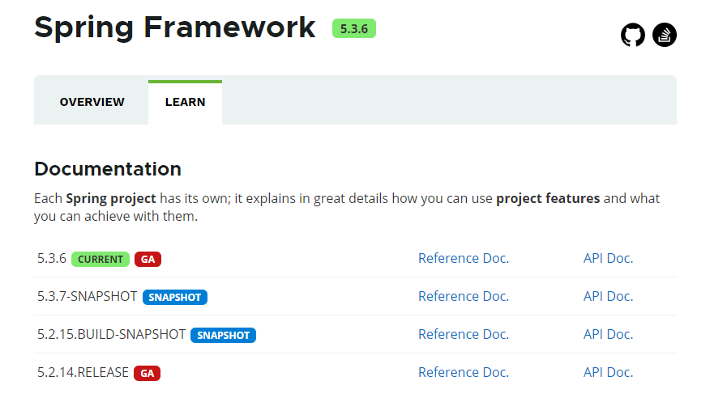
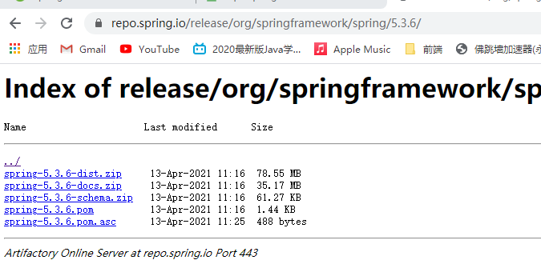
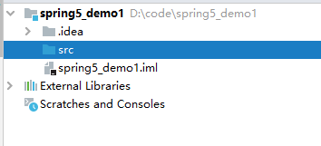
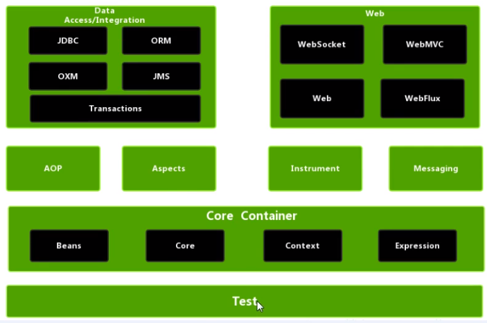
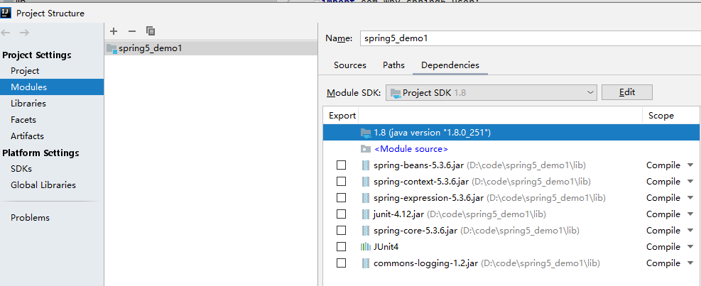

[课程地址](https://www.bilibili.com/video/BV1Vf4y127N5)

# 课程内容

* Spring概念
* IOC容器
* AOP
* JdbcTemplate
* 事务管理
* Spring5 新特性

# Spring框架概述

1. Spring是轻量级的开源JavaEE应用程序框架
2. 解决企业应用开发的复杂性
3. Spring有两个和兴部分：IOC和Aop
   1. IOC: 控制反转，把创建对象的过程交给Spring进行管理
   2. Aop：面向切面，不修改源码进行功能增强

4. Spring特点
   1. 方便解耦，简化开发
   2. Aop编程支持
   3. 方便程序测试
   4. 方便和其他框架进行整合
   5. 方便进行事务操作
   6. 降低API开发难度

5. 现在的课程选取Spring版本5.x

# 入门案例

1. 下载Spring, 使用最新稳定版本5.3.6, spring.io

  2. [下载地址](https://repo.spring.io/release/org/springframework/spring/)

     

3. 创建Java项目

    

4. 导入Spring5相关jar包

> 所需jar包 beans core context expression commons-log

5. 创建普通类，在这个类里创建普通方法

~~~ java
public class User {

    public void add(){
        System.out.println("add ...");
    }
}
~~~

5. 创建Spring配置文件，在配置文件配置创建对象

~~~xml
<?xml version="1.0" encoding="UTF-8"?>
<beans xmlns="http://www.springframework.org/schema/beans"
       xmlns:xsi="http://www.w3.org/2001/XMLSchema-instance"
       xsi:schemaLocation="http://www.springframework.org/schema/beans http://www.springframework.org/schema/beans/spring-beans.xsd">

    <!-- 配置User对象创建 -->
    <bean id="user" class="com.wpy.spring5.User"></bean>
    
</beans>
~~~

6. 进行测试代码编写

~~~ java
package com.wpy.spring5.testdemo;

import com.wpy.spring5.User;
import org.junit.Test;
import org.springframework.context.ApplicationContext;
import org.springframework.context.support.ClassPathXmlApplicationContext;

public class TestSpring5 {

    @Test
    public void testAdd() {
        // 1. 加载spring配置文件
        ApplicationContext context = new ClassPathXmlApplicationContext("bean1.xml");
        // 2. 获取配置创建的对象
        User user = context.getBean("user", User.class);
        System.out.println(user);
        user.add();
    }
}

~~~

